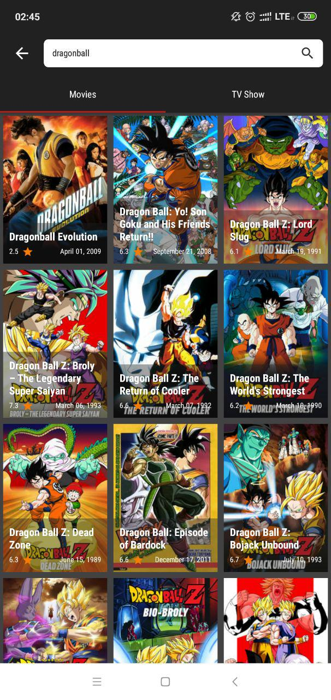

## This is just an step by step Dicoding MADE's Submission
### Important : Check branch for specific submission
### Disclaimer : Make this repository as refference, don't become a cheater and plagiarism.

## Purpose
This repository is intended to all of people who want to learn about Android programming, especially Dicoding's student.

## Screenshoot

## What about this repository?
Thsi repository contains all stage of Dicoding's submission
- [x] Submission 1: Aplikasi Movie Catalogue
- [x] Submission 2: Aplikasi Movie Catalogue (UI/UX)
- [x] Submission 3: Aplikasi Movie Catalogue (API)
- [x] Submission 4: Aplikasi Movie Catalogue (Local Storage)
- [ ] Submission 5: Aplikasi Movie Catalogue (Extended)

## Tech Stack
- [x] Kotlin
- [x] MVP pattern approach
- [x] Retrofit as Third Party API Call
- [x] ObjectBox as Local Database
- [x] Androidx Navigation
- [x] Androidx Component
- [x] Glide
- [x] Shared-Element-Transition

## Author
#### <a href="https://linkedin.com/in/ebysofyan">Eby Sofyan</a>

#### Give ★ if it usefull
